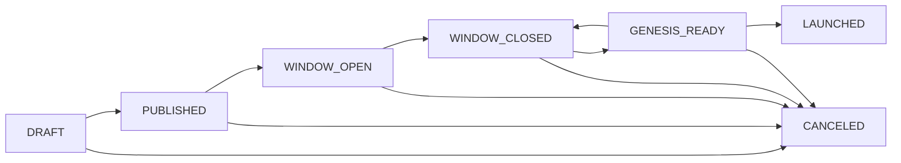

# chaincoord

Self-hosted coordination system for **Cosmos SDK** chain launches.

*`chaincoord` is one of three operator tools I've built for Cosmos SDK chains. The others
are [gentool](https://github.com/ny4rl4th0t3p/cosmos-genesis-tool) (deterministic genesis file generation)
and [pour](https://github.com/ny4rl4th0t3p/pour) (pure-Go multi-chain faucet). Together they cover the painful workflows
of launching and running a Cosmos chain. All three are Apache 2.0 and self-hostable.*

> **Training project for an SDD (Spec Driven Development) exercise.** This codebase was built to explore
> the design space of decentralised genesis coordination. The heavy lifting was done by a supervised AI
> agent. It is research-grade — not for production use.
>
> **Warning:** The web UI has not been fully validated end-to-end. Visual and interaction regressions may exist even
> when the full test suite passes.

📖 **[Full documentation](https://ny4rl4th0t3p.github.io/seedward-chaincoord)** · 🏗️ **[Design document](docs/DESIGN.md)**

---

## What it does

Launching a Cosmos SDK chain requires assembling a genesis file from validator contributions, reaching
multi-party agreement on its content, and ensuring every participant starts from the same file at the
same time. Doing this informally — over chat or shared drives — is error-prone and unaccountable.

**seedward-chaincoord** makes the process explicit, auditable, and multi-party. It covers the full launch lifecycle:



Every state transition is driven by a **committee proposal** that requires M-of-N coordinator signatures
before it executes. A tamper-evident audit log records every action and can be verified offline.

---

## Key concepts

| Concept          | Description                                                                                                                         |
|------------------|-------------------------------------------------------------------------------------------------------------------------------------|
| **Committee**    | M-of-N group of coordinators governing a launch. Any member can raise a proposal; M must sign for it to execute; one VETO kills it. |
| **Proposal**     | A signed, time-limited action (validator approval, lifecycle transition, genesis update, committee change).                         |
| **Join Request** | A validator's application carrying their `gentx`, operator address, and self-delegation amount.                                     |
| **Audit Log**    | Append-only JSONL file; each entry is Ed25519-signed by the server and verifiable offline with `coordd audit verify`.               |

---

## Components

| Component      | Role                                                                                                                                                  |
|----------------|-------------------------------------------------------------------------------------------------------------------------------------------------------|
| `coordd`       | Coordination server — HTTP API + background block monitor                                                                                             |
| `web/app`      | React + TypeScript web frontend — coordinators and validators use their Keplr/Leap wallet to authenticate and interact with the full launch lifecycle |
| `smoke-signer` | Test utility for signing committee and validator actions in E2E / smoke tests                                                                         |

---

## Quick start

### Browser (Docker)

Requires Docker with Compose v2, `make`, and a Keplr or Leap wallet extension in your browser.

```bash
git clone https://github.com/ny4rl4th0t3p/seedward-chaincoord.git
cd seedward-chaincoord
cp .env.example .env          # set COORD_ADMIN_ADDRESSES to your wallet address
make dev-up
```

Open **http://localhost:3000**. Keys are generated automatically on first boot.

Setting `COORD_ADMIN_ADDRESSES` is optional but required to access the admin panel. Use the address you will sign in
with (Cosmos Hub, Osmosis, or Juno).

### API only (local Go build)

```bash
# Build
git clone https://github.com/ny4rl4th0t3p/seedward-chaincoord.git
cd seedward-chaincoord
make build

# Generate keys
mkdir -p data
bin/coordd keygen > data/audit_key
bin/coordd keygen > data/jwt_key
chmod 600 data/audit_key data/jwt_key

# Configure (minimal)
cat > config.yaml <<EOF
listen_addr: ":8080"
db_path: "./data/coord.db"
audit_log_path: "./data/audit.jsonl"
genesis_path: "./data/genesis"
log_level: "debug"
audit_private_key_file: "./data/audit_key"
jwt_private_key_file: "./data/jwt_key"
EOF

# Migrate and run
bin/coordd migrate --config config.yaml
bin/coordd serve --config config.yaml

# Verify
curl http://localhost:8080/healthz
# → {"status":"ok"}
```

---

## Documentation

Full documentation is available at **https://ny4rl4th0t3p.github.io/seedward-chaincoord/**

- [Dev Environment](https://ny4rl4th0t3p.github.io/seedward-chaincoord/getting-started/dev-environment/) — full-stack setup,
  admin config, local dev
- [Web App](https://ny4rl4th0t3p.github.io/seedward-chaincoord/getting-started/web-app/) — sign-in paths, coordinator and
  validator flows, admin panel
- [Concepts overview](https://ny4rl4th0t3p.github.io/seedward-chaincoord/concepts/overview/) — roles, proposals, and the audit
  log
- [Launch lifecycle](https://ny4rl4th0t3p.github.io/seedward-chaincoord/concepts/lifecycle/) — all seven states in detail
- [Roles](https://ny4rl4th0t3p.github.io/seedward-chaincoord/concepts/roles/) — lead coordinator, coordinator, validator
- [Proposals & M-of-N](https://ny4rl4th0t3p.github.io/seedward-chaincoord/concepts/proposals/) — all action types and signing
  rules
- [Setup & Configuration](https://ny4rl4th0t3p.github.io/seedward-chaincoord/reference/setup/) — full config reference, TLS,
  CORS, production options
- [Quickstart](https://ny4rl4th0t3p.github.io/seedward-chaincoord/getting-started/quickstart/) — step-by-step local setup
- [Smoke test](https://ny4rl4th0t3p.github.io/seedward-chaincoord/getting-started/smoke-test/) — end-to-end protocol against a
  live chain
- [API reference](https://ny4rl4th0t3p.github.io/seedward-chaincoord/reference/api/) — HTTP endpoints
- [Audit CLI](https://ny4rl4th0t3p.github.io/seedward-chaincoord/reference/audit/) — offline log verification

---

## Limitations

- Cosmos SDK chains only (secp256k1 keys, `gentx`-based genesis, CometBFT RPC)
- Does not run or connect to a chain node during the launch phase
- Does not store private keys — all signing happens client-side
- Does not assemble the final genesis file — that step is done locally by the coordinator using the chain's node
  binary (e.g. `gaiad genesis collect-gentxs`, `evmosd genesis collect-gentxs`, etc.)
- SQLite-backed by default; not designed for high availability
- Storage and RPC layers are interface-backed — adding PostgreSQL, MySQL, or a different chain RPC adapter requires only
  implementing the relevant interface and wiring it at startup
- The web UI has not been fully validated end-to-end; visual and interaction regressions may exist even when the full
  test suite passes
