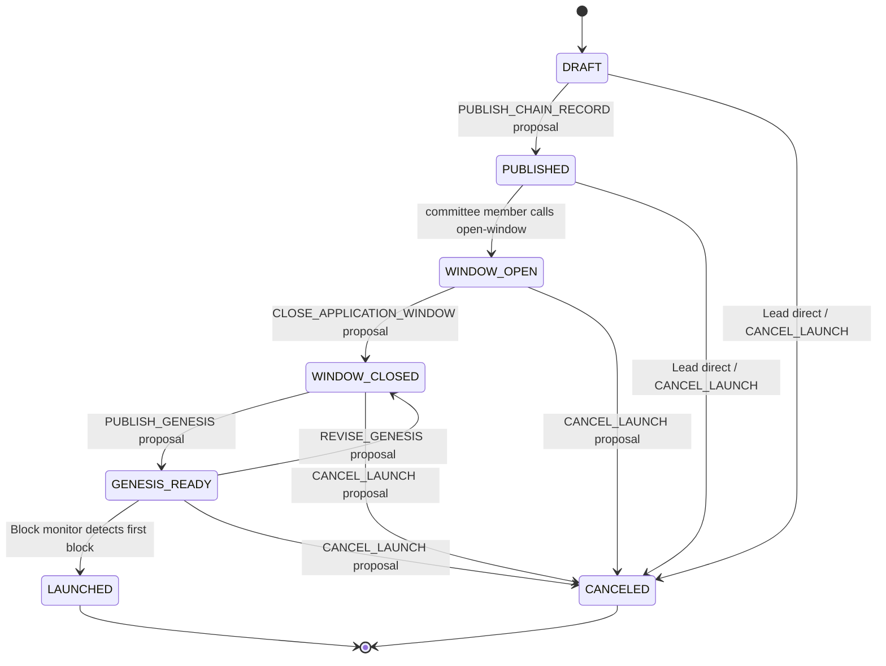

# Launch Lifecycle

A launch moves through seven states. Transitions are one-way (except `GENESIS_READY → WINDOW_CLOSED` for genesis
revision) and each is gated by a committee proposal, except for opening the application window.



---

## DRAFT

The launch exists but is not visible to validators. It was created by a **coordinator**, who declared the chain record
(chain ID, binary, denom, deadlines, commission limits) and the initial committee (members, threshold M, total N) at
creation. During DRAFT the committee prepares it:

- Adjust mutable chain-record fields via `PATCH /api/v1/launch/:id`
- Reconfigure the committee wholesale, if needed — the **lead** only, while still in DRAFT
- Upload the initial genesis file (`POST /api/v1/launch/:id/genesis?type=initial`)

The initial genesis is typically a bare `gaiad init` output with no accounts and no validators — just the base app state
with the correct parameters.

No proposals are required in this phase: DRAFT setup is direct, open to any committee member (by convention the lead)
before publishing.

---

## PUBLISHED

Triggered by: `PUBLISH_CHAIN_RECORD` proposal executing.

The committee attests to the chain record and the initial genesis SHA256. From this point the chain record is
immutable (no further edits to chain ID, binary name, denom, etc.).

Every launch is **private** — visible only to its committee and the addresses on its **members list** (see
[Roles → Membership](roles.md#membership)). A non-member, even with the launch URL, gets a `404`. There is no
public/browsable launch.

Validators cannot apply yet — the application window is not open.

---

## WINDOW_OPEN

Triggered by: Any committee member calls `POST /api/v1/launch/:id/open-window` (no proposal required). If the launch is still
in `DRAFT` and the initial genesis hash has already been uploaded, this call auto-publishes first — a single-step
shortcut equivalent to executing a `PUBLISH_CHAIN_RECORD` proposal.

Validators **on the member list** can now submit join requests — a caller whose (hot) address is not a
committee member or member is `404`'d, so the committee adds each operator's hot address to the member list
(off-band, with a label) before the window opens (see [Roles → Membership](roles.md#membership)). The window
stays open until the committee closes it with a proposal.

During this phase committee members review incoming join requests and raise `APPROVE_VALIDATOR` or `REJECT_VALIDATOR`
proposals. Approved validators accumulate; the server tracks committed voting power and warns if any single entity
reaches or exceeds 1/3 of the total.

---

## WINDOW_CLOSED

Triggered by: `CLOSE_APPLICATION_WINDOW` proposal executing.

Preconditions enforced at close:

- At least `min_validator_count` validators have been approved
- No single entity holds ≥ 1/3 of committed voting power (BFT safety check)

Pending join requests that have not been acted on are expired automatically.

A committee member now assembles the final genesis file locally:

```bash
# Download all approved gentxs
curl .../launch/:id/gentxs | jq -c '.gentxs[]' | ...

# Download the committee-approved allocation files (accounts, claims, grants, …)
curl .../launch/:id/allocations/accounts > accounts.csv

# Apply the approved allocations + gentxs with gentool / the chain binary
gentool genesis ...        # consumes the approved allocation files
gaiad genesis collect-gentxs

# Validate
gaiad genesis validate
```

The genesis allocations are no longer added entry-by-entry: the committee approves each curated allocation file as a
whole (see [Proposals → Allocation files](proposals.md#allocation-files)), and a committee member feeds the **approved**
files into gentool here.

Then uploads the result: `POST /api/v1/launch/:id/genesis?type=final`.

---

## GENESIS_READY

Triggered by: `PUBLISH_GENESIS` proposal executing.

The committee attests to the final genesis SHA256 — but not on trust. Before signing `PUBLISH_GENESIS`, each
committee member can **reproduce the genesis locally from the approved inputs** (approved gentxs + allocation
files + chain record, all pinned by `FinalGenesisInputSetHash`) and confirm their result's hash equals the
proposer's `FinalGenesisSHA256`. The M-of-N signatures are that reproduction-backed attestation, not blind
trust in the uploaded file. (The optional rehearsal service automates it: rebuild from the same input set,
boot an ephemeral chain, and post a signed PASS/FAIL the gate can require before publish.)

With the genesis published, validators can now:

1. Download the final genesis: `GET /api/v1/launch/:id/genesis`
2. Verify the hash: `GET /api/v1/launch/:id/genesis/hash`
3. Submit readiness: `POST /api/v1/launch/:id/ready` (signed confirmation of genesis hash + binary hash)

The server validates each confirmation: the reported genesis hash must equal the published final genesis hash, and —
when the coordinator declared a `binary_sha256` in the chain record — the reported binary hash must match it. A mismatch
is rejected. If no `binary_sha256` was declared, the binary hash is stored but not checked.

Readiness is a **coordination signal, not a gate**: `LAUNCHED` is driven by observed block production (block 1
at the monitor RPC), never by readiness confirmations. Skipping it doesn't block the launch — it only forfeits
the pre-launch check that catches a validator holding the wrong genesis or binary. A committee that wants a
readiness threshold enforces it off-band.

Once any committee member sets a monitor RPC URL (`PATCH /api/v1/launch/:id`), `coordd` starts polling the CometBFT RPC
endpoint once per minute for the first block.

**Genesis revision:** If the genesis file needs to be corrected, the committee can raise a `REVISE_GENESIS` proposal,
which reverts the status to `WINDOW_CLOSED` and clears the final genesis hash. A committee member then re-uploads a
corrected file
and the committee re-raises `PUBLISH_GENESIS`.

---

## LAUNCHED

Triggered by: The block monitor observes block 1 at the configured RPC endpoint — it polls `GET <rpc>/block?height=1`
once per minute and transitions to `LAUNCHED` on a non-null block.

Terminal state. The chain is live.

---

## CANCELED

Triggered by one of two paths, depending on stage:

- **`DRAFT`/`PUBLISHED`** — the lead calls `POST /api/v1/launch/:id/cancel` directly (a lead-only shortcut,
  harmless before any validator has committed). Any committee member may also use the proposal path below.
- **`WINDOW_OPEN` and later** — the direct endpoint returns `409`; cancellation requires an M-of-N
  `CANCEL_LAUNCH` committee proposal. Cancelling from `GENESIS_READY` invalidates readiness confirmations.

Terminal state. No further transitions are possible.