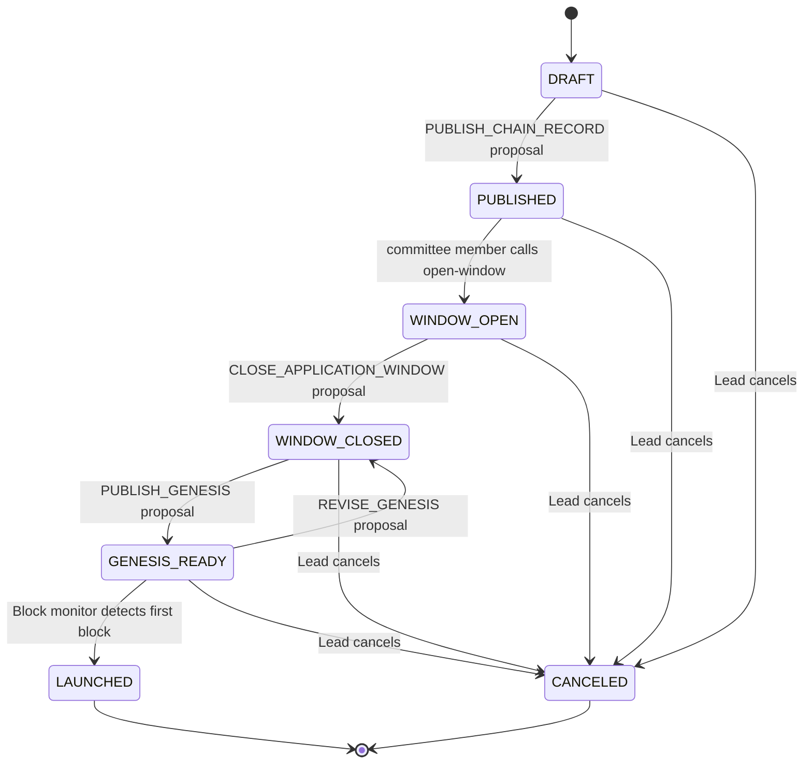

# Launch Lifecycle

A launch moves through seven states. Transitions are one-way (except `GENESIS_READY → WINDOW_CLOSED` for genesis revision) and each is gated by a committee proposal, except for opening the application window.



---

## DRAFT

The launch exists but is not visible to validators. The lead coordinator uses this phase to:

- Configure the chain record (chain ID, binary, denom, deadlines, commission limits)
- Declare the initial committee (members, threshold M, total N)
- Upload the initial genesis file (`POST /launch/:id/genesis?type=initial`)

The initial genesis is typically a bare `gaiad init` output with no accounts and no validators — just the base app state with the correct parameters.

No proposals are required in this phase. The lead coordinator sets everything up unilaterally before publishing.

---

## PUBLISHED

Triggered by: `PUBLISH_CHAIN_RECORD` proposal executing.

The committee attests to the chain record and the initial genesis SHA256. From this point the chain record is immutable (no further edits to chain ID, binary name, denom, etc.).

The launch is visible to validators if `visibility = PUBLIC`. Allowlist launches remain hidden to non-allowlisted addresses.

Validators cannot apply yet — the application window is not open.

---

## WINDOW_OPEN

Triggered by: Any committee member calls `POST /launch/:id/open-window` (no proposal required). If the launch is still in `DRAFT` and the initial genesis hash has already been uploaded, this call auto-publishes first — a single-coordinator shortcut equivalent to executing a `PUBLISH_CHAIN_RECORD` proposal.

Validators can now submit join requests. The window stays open until the committee closes it via proposal.

During this phase coordinators review incoming join requests and raise `APPROVE_VALIDATOR` or `REJECT_VALIDATOR` proposals. Approved validators accumulate; the server tracks committed voting power and warns if any single entity reaches or exceeds 1/3 of the total.

---

## WINDOW_CLOSED

Triggered by: `CLOSE_APPLICATION_WINDOW` proposal executing.

Preconditions enforced at close:

- At least `min_validator_count` validators have been approved
- No single entity holds ≥ 1/3 of committed voting power (BFT safety check)

Pending join requests that have not been acted on are expired automatically.

The lead coordinator now assembles the final genesis file locally:

```bash
# Download all approved gentxs
curl .../launch/:id/gentxs | jq -c '.gentxs[]' | ...

# Add genesis accounts for each approved validator
gaiad genesis add-genesis-account <addr> <amount>

# Collect gentxs
gaiad genesis collect-gentxs

# Validate
gaiad genesis validate
```

Then uploads the result: `POST /launch/:id/genesis?type=final`.

---

## GENESIS_READY

Triggered by: `PUBLISH_GENESIS` proposal executing.

The committee attests to the final genesis SHA256. Validators can now:

1. Download the final genesis: `GET /launch/:id/genesis`
2. Verify the hash: `GET /launch/:id/genesis/hash`
3. Submit readiness: `POST /launch/:id/ready` (signed confirmation of genesis hash + binary hash)

The server validates each confirmation: the reported genesis hash must equal the published final genesis hash, and — when the coordinator declared a `binary_sha256` in the chain record — the reported binary hash must match it. A mismatch is rejected. If no `binary_sha256` was declared, the binary hash is stored but not checked.

Once any committee member sets a monitor RPC URL (`PATCH /launch/:id`), `coordd` starts polling the CometBFT RPC endpoint once per minute for the first block.

**Genesis revision:** If the genesis file needs to be corrected, the committee can raise a `REVISE_GENESIS` proposal, which reverts the status to `WINDOW_CLOSED` and clears the final genesis hash. The lead then re-uploads a corrected file and the committee re-raises `PUBLISH_GENESIS`.

---

## LAUNCHED

Triggered by: The block monitor observes block 1 at the configured RPC endpoint — it polls `GET <rpc>/block?height=1` once per minute and transitions to `LAUNCHED` on a non-null block.

Terminal state. The chain is live.

---

## CANCELED

Triggered by: Lead coordinator calls `POST /launch/:id/cancel` from any non-terminal state.

Terminal state. No further transitions are possible.