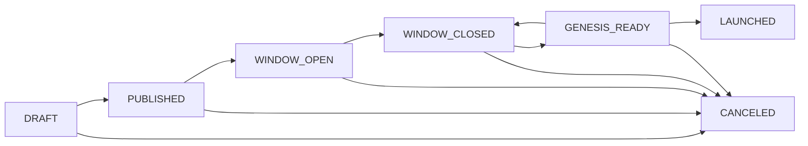

# chaincoord

**chaincoord** is a self-hosted coordination server for **Cosmos SDK** chain genesis launches.

It manages the full launch lifecycle — from assembling a coordinator committee, through validator applications and M-of-N approval, to genesis assembly and block monitoring — with a tamper-evident audit log at every step.

!!! danger "Proof of concept — not for production use"
    chaincoord is research-grade software. It was built to explore the problem space of decentralized genesis coordination. APIs, data formats, and behaviours may change without notice. **Do not use it for mainnet launches or any environment where correctness and availability are required.**

!!! warning "Cosmos SDK only"
    chaincoord is purpose-built for Cosmos SDK chains. It works with standard `gentx`-based genesis files, secp256k1 operator keys, and CometBFT RPC endpoints. It is **not** compatible with EVM, Substrate, or other chain frameworks.

---

## How it works

A launch moves through seven states, each gated by committee action:

| State | What happens |
|---|---|
| **DRAFT** | Coordinator creates the launch and configures the committee |
| **PUBLISHED** | Chain record published; initial genesis file hash committed |
| **WINDOW_OPEN** | Validators submit join requests (gentx + metadata) |
| **WINDOW_CLOSED** | Application window closes; BFT safety check passes (no single entity ≥ 1/3 voting power) |
| **GENESIS_READY** | Final genesis file hash published and confirmed by validators |
| **LAUNCHED** | Block monitoring detects the chain is live |
| **CANCELED** | Launch aborted from any non-terminal state |

Most state transitions are driven by **proposals** — committee actions that require M-of-N coordinator signatures before they execute. The exceptions are direct actions: any committee member can open the application window, the lead coordinator can cancel, and the move to LAUNCHED is detected automatically from the chain.

---

## Key concepts

**Committee** — A group of N coordinators, of which M must sign any proposal for it to execute (M-of-N threshold). One member is designated the lead.

**Proposal** — A signed, time-limited action raised by any committee member. A single VETO from any member kills it. Once M SIGN decisions are collected it executes immediately.

**Join request** — A validator's application to participate, carrying their `gentx`, operator address, and self-delegation amount.

**Audit log** — An append-only JSONL file recording every state transition, proposal, and signature. Each entry is signed with the server's Ed25519 key and can be verified offline with `coordd audit verify`.

---

## Components

| Component | Role |
|---|---|
| `coordd` | The coordination server — HTTP API + background jobs |
| `web/app` | React + TypeScript web frontend — coordinators and validators use their Keplr/Leap wallet to authenticate and interact with the full launch lifecycle |
| `smoke-signer` | Test utility for signing committee and validator actions in smoke/E2E tests |

---

## Next steps

- [Web App](getting-started/web-app.md) — run the full stack with `make dev-up` and use it from a browser wallet
- [Quickstart](getting-started/quickstart.md) — run `coordd` locally in five minutes
- [Setup & Configuration](reference/setup.md) — full configuration reference
- [Concepts](concepts/overview.md) — deeper explanation of roles, proposals, and the lifecycle
- [API Reference](reference/api.md) — HTTP endpoints