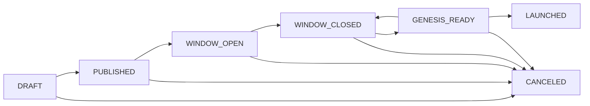

# seedward-chaincoord

**seedward-chaincoord** is a self-hosted coordination server for **Cosmos SDK** chain genesis launches.

It manages the full launch lifecycle — from assembling a committee, through validator applications and
M-of-N approval, to M-of-N agreement on the final genesis and block monitoring — with a tamper-evident audit log at
every step. `coordd` never runs a node, never holds a private key, and never assembles the final genesis itself —
a committee member builds it locally with the chain binary once the committee has agreed.

!!! danger "Not production-ready yet"
seedward-chaincoord is a **feature-complete v1 release candidate** (not yet tagged v1) — a Spec-Driven Development
project: the protocol, the M-of-N
committee governance model, the launch-lifecycle state machine, the threat model, and the offline-verifiable audit-log
design were authored as a spec and implemented with AI assistance under review. It is **not production-ready yet** —
built to get there with real-world testing, and APIs, data formats, and behaviours may still change. **Do not use it
for mainnet launches or any environment where correctness and availability are required.**

!!! warning "Cosmos SDK only"
seedward-chaincoord is purpose-built for Cosmos SDK chains. It works with standard `gentx`-based genesis files,
secp256k1 operator keys, and CometBFT RPC endpoints. It is **not** compatible with EVM, Substrate, or other chain
frameworks.

---

## How it works

A launch moves through seven states, each gated by committee action:

| State             | What happens                                                                                                                                      |
|-------------------|---------------------------------------------------------------------------------------------------------------------------------------------------|
| **DRAFT**         | Coordinator creates the launch and configures the committee                                                                                       |
| **PUBLISHED**     | Chain record published; initial genesis file hash committed                                                                                       |
| **WINDOW_OPEN**   | Members submit join requests (gentx + metadata) — launches are private (committee ∪ members only)                                                 |
| **WINDOW_CLOSED** | Application window closes; BFT safety check passes (no single entity ≥ 1/3 voting power)                                                          |
| **GENESIS_READY** | Committee reproduces the genesis from the approved inputs and attests its hash (M-of-N `PUBLISH_GENESIS`); validators then download and verify it |
| **LAUNCHED**      | Block monitoring detects the chain is live                                                                                                        |
| **CANCELED**      | Launch aborted from any non-terminal state                                                                                                        |

Most state transitions are driven by **proposals** — committee actions that require M-of-N committee-member signatures
before
they execute. A couple of actions are direct: any committee member can open the application window, and the lead can
directly cancel a `DRAFT`/`PUBLISHED` launch (once past `PUBLISHED`, cancellation is an M-of-N `CANCEL_LAUNCH`
proposal). The move to LAUNCHED is detected automatically from the chain.

---

## Key concepts

**Committee** — A group of N committee members, of which M must sign any proposal for it to execute (M-of-N threshold).
One
member is designated the lead.

**Proposal** — A signed, time-limited action raised by any committee member. A single VETO from any member kills it.
Once M SIGN decisions are collected, it executes immediately.

**Membership** — Every launch is private. Only its committee and the addresses on its per-launch **members list**
(managed directly by the committee) can see it or submit a join request; everyone else gets a `404`.

**Join request** — A member's application to participate, carrying their `gentx` and self-delegation amount; the
operator address is derived from the gentx's signer, not supplied as a trusted field.

**Audit log** — An append-only JSONL file recording every state transition and committee proposal. Each entry is
signed with the server's Ed25519 key and can be verified offline with `coordd audit verify`.

---

## Components

| Component                 | Role                                                                                                                                                                                           | Status                                                                                          |
|---------------------------|------------------------------------------------------------------------------------------------------------------------------------------------------------------------------------------------|-------------------------------------------------------------------------------------------------|
| `coordd`                  | The coordination server — HTTP API + background jobs                                                                                                                                           | Release candidate — v1 imminent                                                                 |
| `seedward-chaincoord-web` | React + TypeScript web frontend — **a separate repo**; committee members and validators use their Keplr/Leap wallet to authenticate and drive the full launch lifecycle over coordd's HTTP API | 🚧 **Heavy development** — proof of concept, not production-ready; expect big, breaking changes |
| `smoke-signer`            | Test utility for signing committee and validator actions in smoke/E2E tests                                                                                                                    | Test-only utility                                                                               |

---

## Next steps

- [Run with Docker](getting-started/docker.md) — run `coordd` from the published image. (The full stack —
  coordd + web — lives in seedward-suite.)
- [Quickstart](getting-started/quickstart.md) — run `coordd` locally in five minutes
- [Setup & Configuration](reference/setup.md) — full configuration reference
- [Concepts](concepts/overview.md) — deeper explanation of roles, proposals, and the lifecycle
- [API Reference](reference/api.md) — HTTP endpoints